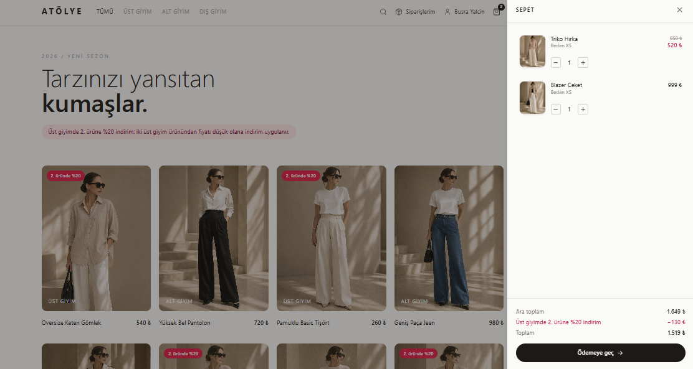
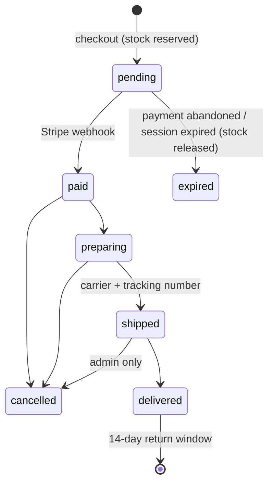

# Atölye — Clothing E-Commerce Store

A full-stack clothing store built with **Next.js**, **PostgreSQL** and **Stripe**. It covers the whole order lifecycle: per-size stock, checkout, cancellations, returns, invoices, shipping, and a campaign engine.



---

## Features

### For customers
- **Browse and shop:** filter by category, search, preview products and pick a size. Sold-out sizes are disabled and low-stock sizes show a "Last 2" badge.
- **Persistent cart:** the cart survives page reloads and the round trip to the payment page.
- **Secure checkout:** card details are entered on Stripe's hosted page and never touch this server.
- **Individual or corporate invoicing:** customers can enter a national ID (optional) or company name, tax number and tax office.
- **My Orders:** a progress bar (Paid → Preparing → Shipped → Delivered), shipment tracking number, and full order history.
- **One-click cancellation** until the order ships, with an automatic refund to the card.
- **Returns within 14 days of delivery:** choose items, quantities and a reason, then follow the request status.
- **Printable invoice** that can be saved as a PDF from the browser.
- **Campaign:** 20% off the cheaper item in every pair of tops, applied automatically, plus a cart hint when one more top would unlock the discount.
- **Accounts:** email and password sign-up, Google sign-in, and password reset by email.

### For the store owner (admin panel)
- **Dashboard** with orders to prepare, open return requests and low-stock alerts.
- **Order workflow:** prepare → ship (carrier and tracking number) → deliver, or cancel with a refund.
- **Return requests:** approve, or reject with a note the customer sees. When the items arrive, refund and optionally restock them.
- **Products and stock:** per-size stock editing. Products can be taken off sale without breaking past orders and invoices.
- **Users:** manage accounts and roles.

---

## Tech stack

| Layer | Technology |
|---|---|
| Framework | Next.js 14 (App Router, Server Components, Route Handlers) |
| UI | React 18, Tailwind CSS, lucide-react |
| Database | PostgreSQL with Prisma ORM |
| Payments | Stripe Checkout (test mode) and webhooks |
| Auth | JWT sessions with `jose` in httpOnly cookies, `bcryptjs`, Google OAuth |
| Email | Resend (password reset) |

---

## How it works

### Order lifecycle



### Engineering decisions

- **Server-side pricing.** The client only sends product IDs, sizes and quantities. Prices, stock and campaign discounts are recalculated on the server. The cart and the server share one pricing function (`src/lib/campaign.js`), so the total a customer sees is always the amount charged.
- **Atomic stock reservation.** Stock is decremented inside a transaction with a `stock >= quantity` condition, so two customers can never buy the last item at the same time. Reservations are released when the customer leaves the payment page, when the Stripe session expires, or by a cleanup job if a webhook is missed.
- **Idempotent state transitions.** Every status change is a conditional update (`WHERE status IN (...)`). Duplicate webhooks, double clicks and retries cannot deduct stock twice or refund twice. Refunds are also sent with Stripe idempotency keys.
- **Webhook with a fallback.** Orders are marked paid by the signed Stripe webhook. The success page also verifies the session with Stripe, in case the webhook is late.
- **Fair partial refunds.** When a discounted line is partially returned, the refund is split proportionally across units. Repeated partial returns never add up to more than the customer paid.
- **Swappable payment provider.** All payment calls live in `src/lib/payments.js`. Stripe does not support businesses based in Turkey, so moving to a local provider such as iyzico or PayTR only touches this one file.
- **Invoices.** Invoices use the GİB e-Archive number format (`ATL2026000000001`). VAT is split from VAT-inclusive prices, and `issueWithProvider` in `src/lib/invoice.js` is the integration point for an official e-Archive provider.

---

## Getting started

### Prerequisites
- Node.js 18 or later
- A PostgreSQL database (for example a free [Neon](https://neon.tech) database)
- A free [Stripe](https://dashboard.stripe.com) account (test mode, no real card needed)

### 1. Install

```bash
git clone https://github.com/busrayalcinn/shopping.git
cd shopping
npm install
cp .env.example .env
```

### 2. Configure `.env`

| Variable | Description |
|---|---|
| `DATABASE_URL` | PostgreSQL connection string |
| `SESSION_SECRET` | At least 32 random characters (see below) |
| `STRIPE_SECRET_KEY` | Stripe **test** secret key (`sk_test_...`) |
| `STRIPE_WEBHOOK_SECRET` | `whsec_...` value printed by `stripe listen` |
| `RESEND_API_KEY` | For password reset emails |
| `GOOGLE_CLIENT_ID` / `GOOGLE_CLIENT_SECRET` | For Google sign-in |
| `NEXTAUTH_URL` | Site URL, e.g. `http://localhost:3000` |
| `SELLER_NAME`, `SELLER_ADDRESS`, `SELLER_TAX_OFFICE`, `SELLER_TAX_ID`, `SELLER_EMAIL` | Seller details printed on invoices |
| `VAT_RATE` | VAT percentage (default `10`) |
| `INVOICE_PREFIX` | 3-letter invoice number prefix (default `ATL`) |

Generate a session secret:

```bash
node -e "console.log(require('crypto').randomBytes(32).toString('hex'))"
```

### 3. Set up the database

```bash
npm run db:migrate   # create tables
npm run db:seed      # add demo products with stock
```

### 4. Run

```bash
npm run dev
```

Open http://localhost:3000.

### 5. Test payments

Install the [Stripe CLI](https://stripe.com/docs/stripe-cli) and forward webhooks to your local server:

```bash
stripe listen --forward-to localhost:3000/api/webhook
```

Put the `whsec_...` value it prints into `STRIPE_WEBHOOK_SECRET`. At checkout, use the test card `4242 4242 4242 4242` with any future date and any CVC.

### 6. Become an admin

Sign up on the site, then open Prisma Studio and change your user's `role` to `admin`:

```bash
npx prisma studio
```

The admin panel is at `/admin`.

---

## Scripts

| Command | Description |
|---|---|
| `npm run dev` | Start the development server |
| `npm run build` | Production build |
| `npm run start` | Run the production build |
| `npm run db:migrate` | Apply migrations in development |
| `npm run db:deploy` | Apply migrations in production |
| `npm run db:seed` | Add demo products and stock |

---

## Project structure

```
prisma/
  schema.prisma           Data model: users, products, stock, orders, returns, invoices
  migrations/             SQL migrations
  seed/products.js        Demo products and stock

src/lib/
  orders.js               Order lifecycle: reservation, payment, cancel, shipping, returns
  campaign.js             Campaign rules and cart pricing (shared by client and server)
  cart.js                 Server-side cart validation and pricing
  payments.js             Payment provider calls (Stripe)
  invoice.js              VAT split, invoice numbering, e-Archive integration point
  orderStatus.js          Status labels and rules (shared by client and server)
  auth.js                 Sessions (JWT in httpOnly cookies)
  db.js                   Prisma client, user and product queries

src/app/
  page.js                 Storefront
  account/orders/         My Orders, cancellations, returns, invoices
  admin/                  Dashboard, orders, returns, products and stock, users
  order/success, cancel   Pages customers land on after the Stripe payment page
  api/checkout            Validate cart, reserve stock, open a Stripe session
  api/webhook             Signed Stripe webhook
  api/orders/[id]/...     Customer cancel and return endpoints
  api/admin/...           Admin endpoints (role-checked)
  api/auth/...            Sign-up, login, logout, Google OAuth, password reset
```

---

## Roadmap

- [ ] Move payments to a provider that supports Turkish businesses (iyzico / PayTR)
- [ ] Connect an e-Archive invoice provider (Paraşüt, Logo, …)
- [ ] Shipping fee and free-shipping threshold
- [ ] Carrier integration so tracking numbers and delivery status update automatically
- [ ] Manage campaigns from the admin panel
